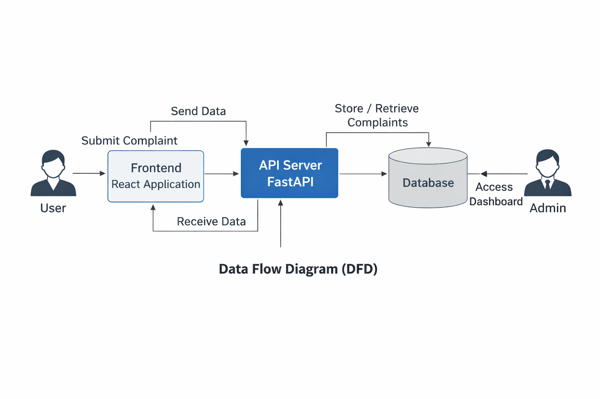

# Lok Dhrishti Project — Round 2 Submission

## Project Overview
Lok Dhrishti is a complaint management system designed to enable users to submit complaints and track their status efficiently. This round adds enhanced features including improved authentication, an admin dashboard, and a polished frontend experience.

---

## Tech Stack

- **Backend:** Python, FastAPI, SQLAlchemy, SQLite/PostgreSQL (or your DB)  
- **Frontend:** React.js, JavaScript, Tailwind CSS (or your CSS framework)  
- **Authentication:** JWT (JSON Web Tokens)  
- **Tools:** Uvicorn (backend server), npm/yarn (frontend package manager)  

---

## Team Contributions

| Team Member    | Contribution Summary                                   |
| -------------- | ---------------------------------------------------- |
| Shreya  | README.md, Navbar, Signup/Login, Forgot Password, Reset Password pages, Home page, and documentation |
| Dilbahar Nawab    | Complaint Form and Complaint List components          |
| Aditya Karnatak    | Admin Dashboard and Admin Complaints management       |
| Pawani Sharma   | Database design and backend APIs                       |

---

## Project Structure

- `backend/` — FastAPI backend with routes for authentication and complaint management  
- `frontend/` — React frontend including components, pages, context, and styles  

---

## How to Run the Project

### Backend

1. Navigate to the `backend` folder.  
2. Create a virtual environment and activate it:

   ```bash
   python -m venv venv
   # Windows:
   venv\Scripts\activate
   # macOS/Linux:
   source venv/bin/activate
   ```
   ### Frontend
 
Navigate to the frontend folder.

Install dependencies:
```bash
npm install
```
Start the React development server:
```bash
npm start
```

---
## Demo Video
You can watch the demo video here:
You can watch the demo video here:  
[Demo Video Link](https://drive.google.com/file/d/17ZIUmJVPlMtU2vWGwtr4VIEe-bG4ZpR5/view?usp=sharing)
---
## Data Flow Diagram



## Flowchart


---
## Notes

This branch contains Round 2 features and improvements.

Round 1 project files are preserved in the round1 branch.

## Contact

For any questions or feedback, please contact:
Shreya — gagnejashreya76@gmail.com
Dilbahar Nawab - dilbaharnawab@gmail.com


